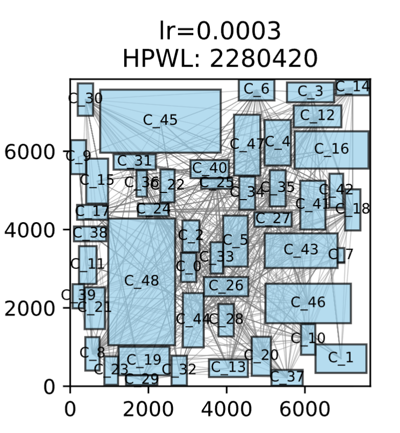
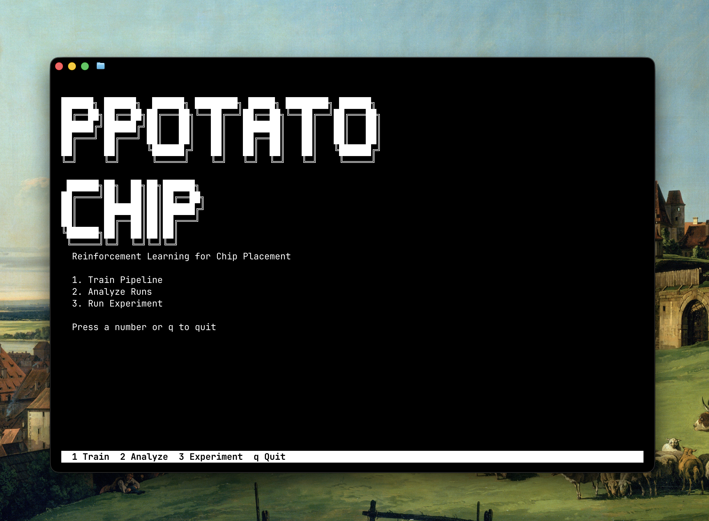

# PPOtatoChip

AlphaChip, but less alpha.
Work in progress.

---




Based on the Google AlphaChip paper.

The idea is to sequentially place components onto a canvas so wirelength stays 
low. PPOtatoChip tries to learn that using Proximal Policy Optimization (PPO)
on Policy Value Networks connected graph neural networks.

There are three stages in the pipeline:

1. **Vanilla PVN** — dumb MLP policy places components one by one, learns
   from negative HPWL(Half Perimeter Wirelength) reward. This generates a dataset of placements with corresponding HPWL.
2. **Reward Predictor** — trains a GNN-MLP combo to predict wirelength from the the dataset generated above.
3. **Graph PPO** — loads that pretrained GNN encoder (or starts from scratch - if you decide not to freeze the encoder)
   and does actual graph-based placement.

The UI is a **Textual TUI**. Pick a netlist, tweak params, let it train.
There is an option to cancel mid-run.

There is also an **experiment system** for parameter sweeps (learning rate,
model capacity, ablation etc.). It runs multiple seeds and
generates a multi-page PDF report with learning curves, HPWL comparisons,
side-by-side placement grids, summary table.

```bash
source ~/venvs/jpter/bin/activate
python src/cli.py
```


Five netlists in `netlists/` — xerox, ami33, ami49, apte, hp. Training
outputs go to `artifacts/` with timestamps. Plots end up in `analysis/`.

I'll make the GNN part actually beat the vanilla baseline
one of these days.


### Dependencies

```
torch
torch_geometric
textual
matplotlib
```

---

## Planned Updates

- **Fix visual bugs** — the tui is functional but sometimes has white bands at random places.
- **Convergence analysis** — need to think more about this.
- **Stress-test hyperparameters** — systematically run every knob (clip
  epsilon, entropy coefficient, hidden dimensions, you name it) in isolation
  to see if something breaks.
- **Better wirelength metric** — HPWL is the standard proxy but it's not
  great. Look into steiner-tree (and other) alternatives that correlate
  better with real routing outcomes.
- **Hybrid with classical placement** — A combination with Simulated Annealing or Force-directed placement might 
  give better results. In fact in AlphaChip, only the macros are placed using the RL model, while the standard cells are 
  placed using standard placers.